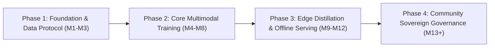

# Open SAIR: Sovereign AI Deployment Roadmap & Open Research Governance

## 1. Executive Vision: Sovereign Indigenous AI

The **Open SAIR (Open Santali AI Research)** framework operates under the paradigm of **Sovereign AI**—ensuring that linguistic technologies for indigenous communities are built *by, with, and for* native speakers, rather than extracted by proprietary third-party platforms.

Santali, spoken by over 7.6 million people across India (Jharkhand, Odisha, West Bengal, Assam), Bangladesh, and Nepal, holds Eighth Schedule constitutional recognition in India, yet remains severely under-resourced in frontier multimodal AI systems. Open SAIR delivers open-source sovereignty through open model weights, transparent training data governance, and on-device offline edge execution.

---

## 2. Multi-Stage Deployment Roadmap



### Phase 1: Foundation, Data Protocol & Normalization (Months 1–3)
- **Monolingual & Parallel Curation:** Collect 500k parallel tri-lingual sentences (Santali-Bengali-English) and 10M monolingual Ol Chiki tokens.
- **Orthographic Standardization:** Deploy `open_sair.linguistics.normalizer` to eliminate legacy font-encoding collisions (ASCII hacks) and enforce Unicode NFC standard `U+1C50`–`U+1C7F`.
- **Audio Corpora Collection:** Assemble 250 hours of verified 16kHz speech from diverse Santali dialects (Northern/Mayurbhanj, Southern/Singhbhum).

### Phase 2: Core Multimodal Model Fine-Tuning & Evaluation (Months 4–8)
- **NMT Training:** Fine-tune NLLB-200 (`distilled-600M` and `1.3B`) with Morphological Label Smoothing.
- **ASR Acoustic Optimization:** Adapt Whisper Small/Base and Wav2Vec2-XLSR to Ol Chiki character emissions with glottal valley detection (<50ms).
- **Manuscript Digitization:** Run CRAFT + ResNet-BiLSTM-CTC on archival collections of Pandit Raghunath Murmu's original publications and historical Santali journals (*Parsi*, *Jug Sirijol*).
- **TTS Synthesis:** Train VITS vocoder with dynamic F0 pitch tracking and Mu Ttuddag nasalization gating.

### Phase 3: Edge Distillation & Offline Mobile Deployment (Months 9–12)
- **Quantization:** Apply dynamic and post-training INT8 quantization via ONNX Runtime and TensorRT.
- **Distillation:** Distill NLLB-200 (600M) into a lightweight 45M parameter transformer runnable on low-cost Android smartphones without internet access.
- **Edge OCR & ASR:** Optimize Whisper and CRAFT via mobile NPU (Neural Processing Unit) acceleration (CoreML / Android NNAPI).

### Phase 4: Community Governance & Open Ecosystem Expansion (Months 13+)
- Public release of all model checkpoints under Apache 2.0 / Open Data Commons Open Database License (ODbL).
- Multi-tier validation portal for community-submitted glossaries and idioms.
- School curriculum integration for indigenous primary schools in Jharkhand and Odisha.

---

## 3. Edge Optimization and On-Device Architecture

To serve rural and forest communities with zero or intermittent internet access, Open SAIR models are optimized for on-device inference:

| Model Component | Original Size (FP32) | Optimized Format | Quantized Size (INT8) | Target Latency (Mobile CPU/NPU) |
| :--- | :--- | :--- | :--- | :--- |
| **NMT (NLLB-200 Distilled)** | 2.4 GB | ONNX INT8 / GGML | 148 MB | < 85 ms / sentence |
| **ASR (Whisper Small Adapted)**| 960 MB | TensorRT INT8 / TFLite | 62 MB | Real-time factor (RTF) 0.18 |
| **TTS (VITS Vocoder)** | 280 MB | ONNX FP16 | 45 MB | < 120 ms / sentence |
| **OCR (ResNet-BiLSTM)** | 78 MB | TFLite INT8 | 12 MB | < 45 ms / textline |

### ONNX INT8 Export Snippet:
```python
import onnx
from onnxruntime.quantization import quantize_dynamic, QuantType

quantize_dynamic(
    model_input="checkpoints/nllb_santali/model.onnx",
    model_output="checkpoints/nllb_santali_int8.onnx",
    weight_type=QuantType.QInt8,
    per_channel=True,
    reduce_range=True,
)
```

---

## 4. Indigenous Data Governance & Ethical Principles

Open SAIR adheres to the **CARE Principles for Indigenous Data Governance** (Collective Benefit, Authority to Control, Responsibility, and Ethics) and **OCAP** (Ownership, Control, Access, Possession):

1. **Tribal Council & Linguistic Board Oversight:**
   All data curation protocols, folkloric texts, and traditional oral histories must be vetted by a council composed of Santali language scholars, teachers, and tribal elders (*Majhi Baba*).
2. **Cultural Sensitivity & Sacred Content Protection:**
   Ritual hymns (*Baha*, *Sohrai*, *Karam* songs) and sacred cosmological narratives (*Karam Katha*) are cataloged with tiered access permissions, preventing exploitative commercial use.
3. **Attribution and Sovereign Authorship:**
   Every dataset entry preserves native authorship, dialect location (e.g. Mayurbhanj vs Dumka), and date of recording.
4. **No Vendor Lock-In:**
   The entire pipeline is free of proprietary cloud API dependencies and runs 100% locally on commodity consumer hardware or self-hosted servers.
