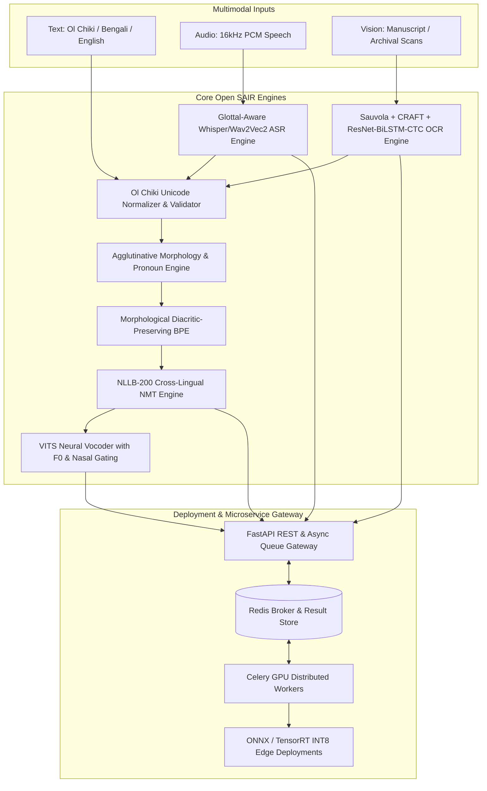
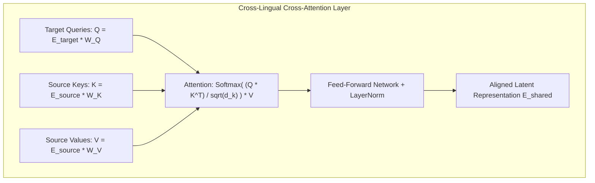
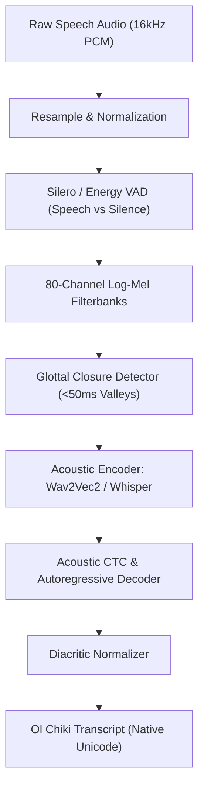
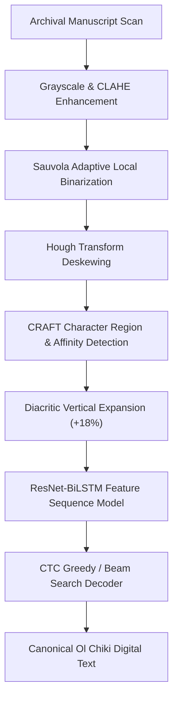
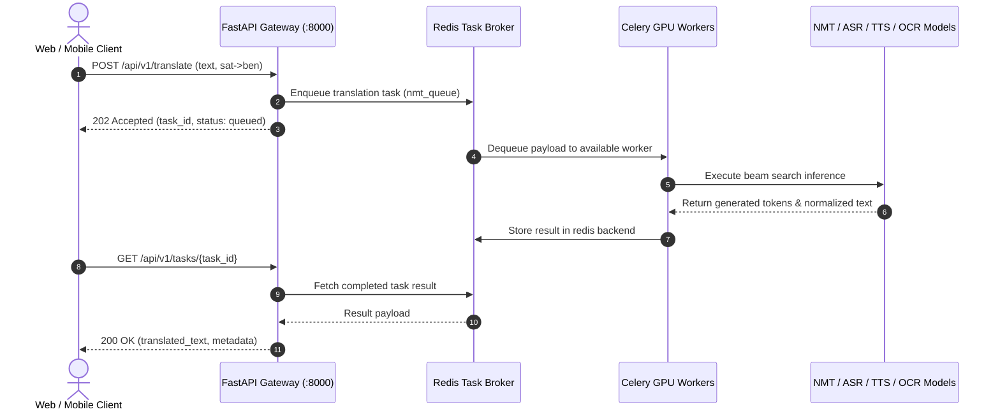

# Open SAIR: System Architecture & Technical Design Specification
**Unified Open-Source Multimodal AI Framework for Santali (Ol Chiki), Bengali, and English**

---

## 1. Executive System Overview & Architectural Objectives

**Open SAIR (Open Santali AI Research)** is an open-source, sovereign multimodal artificial intelligence system designed to process, translate, transcribe, synthesize, and digitize the Santali language in its native **Ol Chiki script** (`U+1C50` to `U+1C7F`), alongside **Bengali** (`U+0980` to `U+09FF`) and **English** (Latin).

---

## 2. Module 1: Multimodal Architecture & Cross-Lingual Alignment Engine

### 2.1. Text Engine & Tokenization Strategy
- **Ol Chiki Unicode Space:** Strict boundary confinement between `U+1C50` and `U+1C7F`.
- **Atomic Grapheme Clustering:** Ol Chiki is an alphabetic script where modifiers (`ᱸ`, `ᱹ`, `ᱺ`, `ᱻ`, `ᱼ`, `ᱽ`) cannot be detached from base letters. Open SAIR implements atomic grapheme binding in BPE subword segmentation, ensuring modifiers are never split across merge operations.
- **Directional Tags:** `<sat_Olck>`, `<ben_Beng>`, `<eng_Latn>`.

### 2.2. Audio/Speech Engine
- Standardized to 16 kHz Mono 16-bit PCM.
- 80-channel Log-Mel Spectrogram extraction (25ms window, 10ms hop length, 400 FFT points).
- Dynamic glottal frame isolation for rapid energy dropouts (<50ms) characteristic of unreleased checked consonants (*Keched Arang*).

### 2.3. Speech Synthesis (TTS) Engine
- **Architecture:** VITS (Variational Inference with adversarial learning for end-to-end Text-to-Speech) / FastSpeech2 backbone.
- **Explicit Nasalization Gating:** Velopharyngeal aperture modulation ($0.0 \le \gamma_{\text{nasal}} \le 1.0$) driven specifically by the presence of **Mu Ttuddag** (`ᱸ`) or **Mu-Gaahlaa Ttuddag** (`ᱺ`).
- **Pitch Control:** Continuous F0 target generation parameterized by syllabic stress and vowel length sign **Relaa** (`ᱻ`).

### 2.4. Vision (OCR) Engine
- Diacritic-aware manuscript recognition featuring Sauvola adaptive local thresholding, Hough transform deskewing, CRAFT text detection, and ResNet-BiLSTM-CTC recognition.

### 2.5. Mathematical Formulation: Shared Embedding Space Alignment
To bridge linguistic representations $E_{\text{sat}}, E_{\text{ben}}, E_{\text{eng}} \in \mathbb{R}^d$:

#### 1. Bidirectional InfoNCE Contrastive Loss:
$$\mathcal{L}_{\text{InfoNCE}}(x_i, y_i) = - \frac{1}{2} \left[ \log \frac{\exp(\text{sim}(z_i, z_i^+) / \tau)}{\sum_{j=1}^B \exp(\text{sim}(z_i, z_j) / \tau)} + \log \frac{\exp(\text{sim}(z_i^+, z_i) / \tau)}{\sum_{j=1}^B \exp(\text{sim}(z_j^+, z_i) / \tau)} \right]$$
where $z_i = \frac{W_p E(x_i)}{\|W_p E(x_i)\|_2}$ and $\tau$ is a learnable temperature parameter.

#### 2. Orthogonal Procrustes Transformation:
$$W^* = \arg\min_{W \in \mathcal{O}(d)} \| W X_{\text{sat}} - X_{\text{eng}} \|_F^2 \quad \text{subject to } W^T W = I$$
Solved via Singular Value Decomposition:
$$X_{\text{eng}} X_{\text{sat}}^T = U \Sigma V^T \implies W^* = U V^T$$

---

## 3. Module 2: Cross-Lingual Grammatical Alignment & Morphology Handler

### 3.1. Word Order & Syntactic Transformations
- **English (SVO):** Head-initial, analytic, prepositional.
- **Bengali (SOV):** Head-final, inflectional, postpositional.
- **Santali (SOV Agglutinative):** Head-final, polysynthetic verbal complexes, postpositional, pronominal enclitic incorporation.

$$\text{Constituent Reordering: } [S, V, O] \underset{\text{SVO} \rightarrow \text{SOV}}{\longleftrightarrow} [S, O, V]$$

### 3.2. Santali Pronoun Matrix Engine
Santali enforces a strict distinction between **Inclusive** (`alaṅ`, `abo`) and **Exclusive** (`aliń`, `ale`) first-person pronouns across Singular, Dual, and Plural:

| Number | Inclusive Form | IPA | Listener Included? | Exclusive Form | IPA | Listener Included? |
| :--- | :--- | :--- | :--- | :--- | :--- | :--- |
| **Dual** | **ᱟᱞᱟᱝ** (*alaṅ*) | /alaŋ/ | **YES** (You and I) | **ᱟᱞᱤᱧ** (*aliń*) | /aliɲ/ | **NO** (He/she and I) |
| **Plural** | **ᱟᱵᱚ** / **ᱟᱵᱚᱱ** (*abo*) | /abo/ | **YES** (All of us + You) | **ᱟᱞᱮ** (*ale*) | /ale/ | **NO** (All of us without you)|

### 3.3. Phonetic Modeling: Checked Consonants (*Keched Arang*) & Deglottalizer (*Ahad*)
Santali possesses four unreleased checked stops articulated with glottal closure:
1. Velar: **ᱜ** (`U+1C5C`) $\rightarrow$ $[k̚ˀ]$
2. Palatal: **ᱡ** (`U+1C61`) $\rightarrow$ $[c̚ˀ]$
3. Dental: **ᱫ** (`U+1C6B`) $\rightarrow$ $[t̚ˀ]$
4. Bilabial: **ᱵ** (`U+1C75`) $\rightarrow$ $[p̚ˀ]$

When followed by **Ahad** (`ᱽ`, `U+1C7D`), the glottal closure is released, transitioning into voiced plosives:
$$\text{ᱜ} + \text{ᱽ} \rightarrow [g], \quad \text{ᱡ} + \text{ᱽ} \rightarrow [\text{ɟ}], \quad \text{ᱫ} + \text{ᱽ} \rightarrow [d], \quad \text{ᱵ} + \text{ᱽ} \rightarrow [b]$$

---

## 4. Module 3: Dataset Pipeline & Preprocessing Standards

### 4.1. Text Cleaning & Canonical Normalization Pipeline
1. **Unicode NFC Enforcement:** Guarantee decomposed code points are canonicalized.
2. **Canonical Modifier Ordering:**
   $$\text{Base Letter} \rightarrow \text{Gaahlaa Ttuddag (ᱹ)} \rightarrow \text{Mu Ttuddag (ᱸ)} \rightarrow \text{Ahad (ᱽ)} / \text{Relaa (ᱻ)}$$
3. **Punctuation Normalization:** Standardizes Latin `.` and Bengali `।` into native Ol Chiki Mucaad (`᱾`).
4. **Length Ratio Constraints:** $0.4 \le \frac{\text{len}(\text{sat})}{\text{len}(\text{eng})} \le 2.5$.

### 4.2. Audio Standardization
- 16 kHz mono PCM WAV format.
- Energy-based Voice Activity Detection (VAD) with $-40\text{ dB}$ threshold.
- Rejection of audio clips with Signal-to-Noise Ratio (SNR) $< 14\text{ dB}$.

---

## 5. Module 4: Neural Machine Translation (NMT) Pipeline

### 5.1. Backbone Architecture
- Model: `facebook/nllb-200-distilled-600M` and `facebook/nllb-200-1.3B`.
- Cross-attention parameterization: 16 attention heads, $d_{\text{model}} = 1024$, dropout $0.1$.
- Special tokens added: `sat_Olck`, `ben_Beng`, `eng_Latn`.

### 5.2. Loss Function: Label Smoothing Cross-Entropy with Morphological Regularizer
$$\mathcal{L}(\theta) = (1 - \epsilon) \mathcal{L}_{\text{CE}}(\theta) + \frac{\epsilon}{|V|} \sum_{v \in V} (-\log P(v)) + \lambda_{\text{morph}} \mathcal{L}_{\text{boundary}}$$
where $\epsilon = 0.1$ is the label smoothing factor, and $\lambda_{\text{morph}}$ penalizes subword splits across diacritic bounds.

### 5.3. Optimizer & Scheduler Configuration
- **Optimizer:** AdamW with $\beta_1 = 0.9, \beta_2 = 0.98, \epsilon = 10^{-8}$, weight decay $= 0.01$ (LayerNorm and bias excluded).
- **Learning Rate:** Peak $5 \times 10^{-5}$ with linear warmup for 2,000 steps followed by cosine annealing decay.
- **Precision:** Mixed precision (FP16/BF16) with gradient accumulation steps $= 4$.

---

## 6. Module 5: ASR & Speech Processing Pipeline

### 6.1. Glottal Closure Feature Modeling
Checked consonants in Santali feature an abrupt decay in RMS amplitude within $<50\text{ ms}$, followed by an unreleased silence or abrupt burst. The Open SAIR acoustic decoder biases token prediction toward checked stops whenever a sub-50ms acoustic valley is detected.

---

## 7. Module 6: Diacritic-Aware OCR Engine for Ol Chiki Manuscripts

Historical Santali manuscripts (such as Pandit Raghunath Murmu's early treatises) frequently suffer from paper discoloration, ink bleed-through, and low contrast.

### 7.1. Sauvola Adaptive Binarization Formulation
$$T(x, y) = m(x, y) \cdot \left( 1 + k \cdot \left( \frac{s(x, y)}{R} - 1 \right) \right)$$
where $m(x, y)$ is the local window mean intensity, $s(x, y)$ is the standard deviation, $R = 128$ is the dynamic range, and $k = 0.2$ is the control parameter.

### 7.2. Diacritic Bounding Box Expansion
To prevent clipping of superscript nasal dots (Mu Ttuddag `ᱸ`) and subscript open-vowel dots (Gaahlaa Ttuddag `ᱹ`), detected bounding boxes are vertically expanded:
$$y_{\text{min}}' = \max(0, y_{\text{min}} - 0.18 \cdot H), \quad y_{\text{max}}' = \min(H_{\text{doc}}, y_{\text{max}} + 0.18 \cdot H)$$

---

## 8. Module 7: Microservice Deployment Architecture

Open SAIR utilizes a high-throughput **FastAPI Gateway** that dispatches requests to dedicated **Celery GPU Workers** over a **Redis** message broker.

### Microservice Endpoints:
- `POST /api/v1/translate`: Multilingual NMT routing.
- `POST /api/v1/asr`: Whisper/Wav2Vec2 transcription.
- `POST /api/v1/tts`: VITS speech synthesis with pitch/nasalization.
- `POST /api/v1/ocr`: Manuscript document image transcription.
- `POST /api/v1/morphology/pronoun`: Explicit clusivity disambiguation.
- `GET /api/v1/health`: System status and worker pool telemetry.

---

## 9. Module 8: Evaluation, Benchmark & Metrics Framework

### 9.1. Quantitative Evaluation Suite

| Modality | Primary Metric | Secondary Metric | Specialized Linguistic Metric |
| :--- | :--- | :--- | :--- |
| **NMT** | **SacreBLEU** | **chrF++** ($n=6, \beta=2.0$) | **Pronoun Clusivity Consistency (PCC)** |
| **ASR** | **Word Error Rate (WER)** | **Character Error Rate (CER)** | **Glottal Error Rate (GER)** |
| **OCR** | **Character Error Rate (CER)** | **Normalized Edit Distance** | **Diacritic Error Rate (DER)** |
| **TTS** | **Mean Opinion Score (MOS)** | **Mel-Cepstral Distortion (MCD)** | **F0 RMSE & Nasalization Precision** |

### 9.2. Specialized Linguistic Formulations

#### 1. Glottal Error Rate (GER):
$$\text{GER} = \frac{\text{Levenshtein}(G_{\text{hyp}}, G_{\text{ref}})}{|G_{\text{ref}}|} \times 100\%$$
where $G$ denotes the sub-sequence of checked consonants (`ᱜ`, `ᱡ`, `ᱫ`, `ᱵ`).

#### 2. Diacritic Error Rate (DER):
$$\text{DER} = \frac{\text{Levenshtein}(D_{\text{hyp}}, D_{\text{ref}})}{|D_{\text{ref}}|} \times 100\%$$
where $D$ denotes the sub-sequence of Ol Chiki modifiers (`ᱸ`, `ᱹ`, `ᱺ`, `ᱻ`, `ᱼ`, `ᱽ`).
